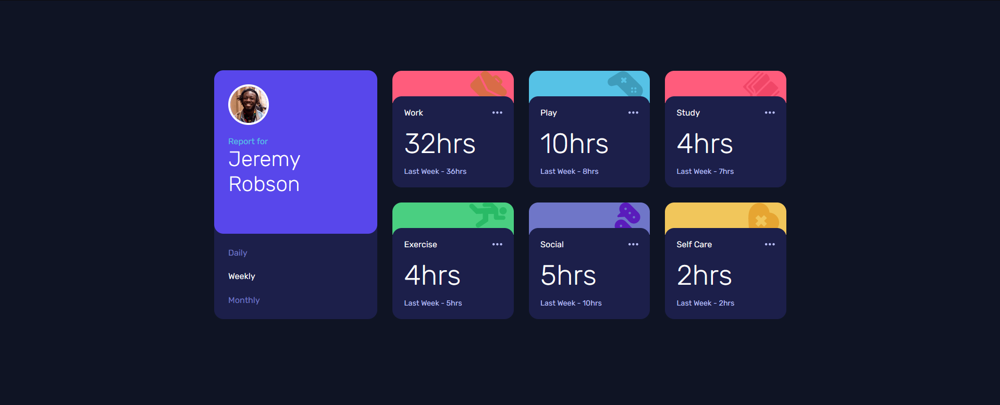
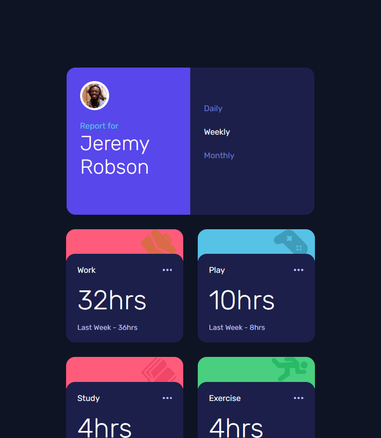
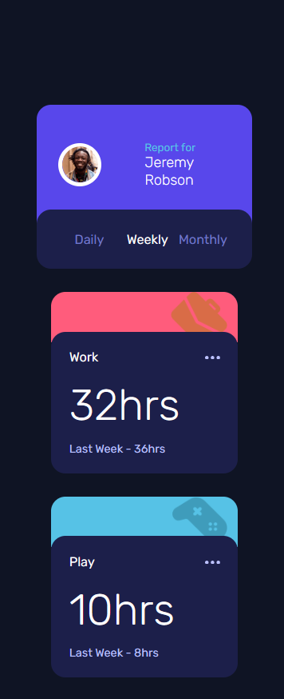

# Frontend Mentor - Time tracking dashboard solution

This is a solution to the [Time tracking dashboard challenge on Frontend Mentor](https://www.frontendmentor.io/challenges/time-tracking-dashboard-UIQ7167Jw). Frontend Mentor challenges help you improve your coding skills by building realistic projects. 

## Table of contents

- [Overview](#overview)
  - [The challenge](#the-challenge)
  - [Screenshot](#screenshot)
  - [Links](#links)
- [My process](#my-process)
  - [Built with](#built-with)
  - [What I learned](#what-i-learned)
- [Author](#author)

## Overview

### The challenge

Users should be able to:

- View the optimal layout for the site depending on their device's screen size
- See hover states for all interactive elements on the page
- Switch between viewing Daily, Weekly, and Monthly stats

### Screenshot





### Links

- Solution URL: [GitHub](https://your-solution-url.com)
- Live Site URL: [Live Site](https://your-live-site-url.com)

## My process

### Built with

- Semantic HTML5 markup
- CSS custom properties
- Flexbox
- CSS Grid
- JavaScript

### What I learned

I am proud of how I was able to style this design with flex and grid I think I was quite creative with it also I am proud of my javascript I had some trouble understanding fetch

```css
.profile-details .profile-user {
        background-color: var(--Blue);
        width: 300px;
        padding: 30px;
        border-radius: 20px;
        display: grid;
        grid-template-columns: 1fr 1fr;
        justify-content: center;
        align-items: center;
}
    
.profile-details .profile-user img {
        width: 50%;
        border: 5px solid #fff;
        border-radius: 50%;
        grid-row: 1 / 3;
        margin-top: -30px;
}
```
```js
    const fetchData = async () => {
        const res = await fetch("/data.json");
        const data = await res.json();
        return data;
    }
```

## Author

- Name - Induwara Thisarindu
"# time-tracking-dashboard-frontend-mentor" 
